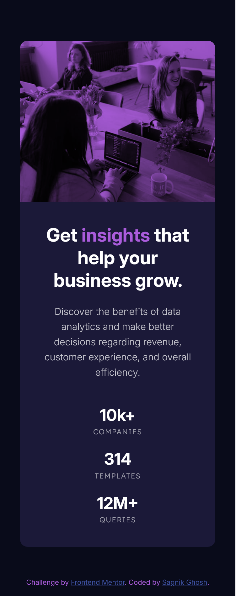

# Frontend Mentor - Stats preview card component solution

This is a solution to the [Stats preview card component challenge on Frontend Mentor](https://www.frontendmentor.io/challenges/stats-preview-card-component-8JqbgoU62). Frontend Mentor challenges help you improve your coding skills by building realistic projects.

## Table of contents

- [Overview](#overview)
  - [The challenge](#the-challenge)
  - [Screenshot](#screenshot)
  - [Links](#links)
- [My process](#my-process)
  - [Built with](#built-with)
  - [What I learned](#what-i-learned)
- [Author](#author)

## Overview

### The challenge

Users should be able to:

- View the optimal layout depending on their device's screen size

### Screenshot




### Links

- Solution URL: [Add solution URL here](https://your-solution-url.com)
- Live Site URL: [Add live site URL here](https://your-live-site-url.com)

## My process

### Built with

- Semantic HTML5 markup for structuring the content of the card
- CSS3 custom properties for styling
- Flexbox for creating a responsive layout
- Mobile-first workflow
- Media queries for handling responsiveness

### What I learned

- Leveraged pseudo-elements and mix-blend-mode to add a color overlay to the image, giving it a unique and striking effect

```CSS
.card__img-container::before {
    content: "";
    position: absolute;
    inset: 0;
    background-color: var(--accent-color);
    mix-blend-mode: multiply;
}
```

## Author

- Website - [Sagnik Ghosh](https://sagnik-ghosh.vercel.app)
- Frontend Mentor - [@sagnikghosh1999](https://www.frontendmentor.io/profile/sagnikghosh1999)
- Twitter - [@sagnikghosh1999](https://www.twitter.com/sagnikghosh1999)
